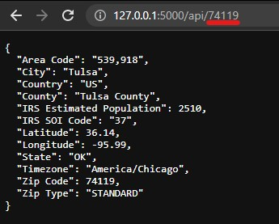

<a name="readme-top"></a>

<br />
<div align="center">
  <a href="https://github.com/Afrokk/ZipState.rest">
    
  </a>
  <h3 align="center">ZipState</h3>
  <p align="center">
    A free API for querying state data from a given US ZIP code.    
    <br />
    <a href="#about-the-project"><strong>Check it out »</strong></a>
    <br />
    <br />
    <a href="#usage">View Demo</a>
    ·
    <a href="https://github.com/Afrokk/ZipState.rest/issues">Report Bug</a>
    ·
    <a href="https://github.com/Afrokk/ZipState.rest/issues">Request Feature</a>
  </p>
</div>

<details>
  <summary>Table of Contents</summary>
  <ol>
    <li>
      <a href="#about-the-project">About The Project</a>
      <ul>
        <li><a href="#built-with">Built With</a></li>
      </ul>
    </li>
    <li>
      <a href="#getting-started">Getting Started</a>
      <ul>
        <li><a href="#prerequisites">Prerequisites</a></li>
        <li><a href="#installation">Installation</a></li>
      </ul>
    </li>
    <li><a href="#usage">Usage</a></li>
    <li><a href="#roadmap">Roadmap</a></li>
    <li><a href="#contributing">Contributing</a></li>
    <li><a href="#license">License</a></li>
    <li><a href="#contact">Contact</a></li>
  </ol>
</details>

## About The Project

[![Product Name Screen Shot][product-screenshot]]()

A REST API built on the WSGI server platform that gives details like State, Country, IRS SOI Code, Longitude/Latitude & much more from a given ZIP code. 

Gives the following information from a particular US zip code:
    <ul>
      <li>ZIP Type</li>
      <li>State Abbreviation</li>
      <li>City</li>
      <li>County</li>
      <li>Timezone</li>
      <li>IRS SOI Code</li>
      <li>Area Code</li>
      <li>Country</li>
      <li>Latitude/Longitude</li>
      <li>IRS Estimated Population</li>
    </ul>

<p align="right">(<a href="#readme-top">back to top</a>)</p>

### Built With

* [![Python][Python.com]][Python-url]
* [![Flask][Flask.com]][Flask-url]
* [![PostgreSQL][PostgreSQL.com]][PostgreSQL-url]
* [![Jinja][Jinja.com]][Jinja-url]
* [![HTML][HTML.com]][HTML-url]
* [![CSS][CSS.com]][CSS-url]

<p align="right">(<a href="#readme-top">back to top</a>)</p>

## Getting Started
Here's how to set this project up for development purposes.

### Prerequisites
You will need Python and PostgreSQL installed:

* Python
  ```sh
  sudo apt install python3.10

* PostgreSQL
  ```sh
  sudo apt install postgresql postgresql-contrib 

Ensure that the PostgreSQL service is started:
* Start PostgreSQL Service
  ```sh
  sudo service postgresql restart

### Setup
Use `python3 -V` and `psql -V` to verify that both Python and PostgreSQL are setup properly. 

1. Clone this repository:
   ```sh
   git clone https://github.com/Afrokk/soy.rest
   ```
  The repository already comes with a virtual environment `vEnv` which you can use. 

2. Activate the virtual environment using: 
    ```sh
    source <yourRootPath>/soy.rest/vEnv/bin/activate
    ```
    In my case, this was:
    ```sh
    source /home/afrokk/Projects/soy.rest/vEnv/bin/activate
    ```

    This will activate the virtual environment. 

3. Install the required dependencies:

    Once you are in the virtual environment, run
    ```sh
    pip3 install -r requirements.txt
    ```
    This will install all the required dependencies.
  
4. Create a blank PostgreSQL database by running the following commands:
    ```sh
    sudo -iu postgres psql
    ```

    Create a database:
    ```sql
    CREATE DATABASE state_data;
    ```

    Create a user for your database:
    ```sql
    CREATE USER <yourUsername> WITH PASSWORD 'yourPassword';
    ```

    Grant the user permissions to the database:
    ```sql
    GRANT ALL PRIVILEGES ON DATABASE state_data TO <yourUsername>;
    ```

    Verify everything was created successfully:
    ```sh
    \l
    ```
    The `\l` command should display a list of databases on your system, and should include the database called `state_data` we created above.

    Exit from psql:
    ```sh
    \q
    ```

5. Import the dataset into your database:
    ```sh
    psql -U afrokk state_data < dataset.pgsql
    ```
    After this, your database is all setup!

6. Start the application:

    Setup environment variables:
    ```sh
    export DB_USERNAME=<yourUsername>
    export DB_PASSWORD='<yourPassword>'
    ```
    The `username` and `password` should be the same as ones you setup in step 4. After this, run

    ```sh
    flask --app api run
    ```
    If the above command gives a `flask: command not found` error, run this instead:
    ```sh
    python3 -m flask --app api run
    ```
    This will start the application with everything setup as needed.

_Note: If you are encountering issues with `app.py` warning about libraries not found, you need to select the Python interpreter for the `vEnv` virtual environment. You can do so by pressing `Ctrl+Shift+P` and selecting `Python: Select Interpreter` in VSCode. Then, select `Enter interpreter path` and give it the path to `python3.10` file located in `vEnv/bin/`. Read more about this [here](https://code.visualstudio.com/docs/python/environments#_using-the-create-environment-command)._

<p align="right">(<a href="#readme-top">back to top</a>)</p>

## Usage
The ZipState API has two endpoints, one at `/api` and one at `/api/<ZIPCode>`.

### `/api`:
This endpoint returns the state details of a random ZIP code, in JSON.

<p align="center">
    
</p>

### `/api/<ZIPCode>`:
This endpoint returns the state details of the provided US ZIP code, also in JSON.

<p align="center">
    
</p>

Both endpoints use the HTTP `GET` method to retrieve the state details from the database.

## Roadmap
Some of the things I'd like to do with this project, as I work on it:

- [x] Gather necessary data and clean it up.
- [x] Setup database.
- [x] Code the API. (IN PROGESS)
- [x] Add JSON functionality and setup routes. 
  - [x] COMPLETED.

## Contributing
Contributions are what make the open source community such an amazing place to learn, inspire, and create. Any contributions you make are **greatly appreciated**.

If you have a suggestion that would make this better, please fork the repo and create a pull request. Don't forget to give the project a star! Thanks again!

<p align="right">(<a href="#readme-top">back to top</a>)</p>

<!-- LICENSE -->
## License
Distributed under the MIT License. See `LICENSE` for more information.

## Contact
If you have any feedback or need help, please reach out to me:

Afrasiyab (Afrokk) Khan - [@afrokk_](https://www.instagram.com/afrokk_/) - [afrokk.dev](https://afrokk.dev/) - [LinkedIn](https://www.linkedin.com/in/afrasiyab-k/) - hi@afrokk.dev

<p align="right">(<a href="#readme-top">back to top</a>)</p>

[product-screenshot]: images/api.jpg
[Python.com]: https://img.shields.io/badge/python-3670A0?style=for-the-badge&logo=python&logoColor=ffdd54
[Python-url]: https://www.python.org/
[Flask.com]: https://img.shields.io/badge/flask-%23000.svg?style=for-the-badge&logo=flask&logoColor=white
[Flask-url]: https://flask.palletsprojects.com/en/2.2.x/
[PostgreSQL.com]: https://img.shields.io/badge/postgres-%23316192.svg?style=for-the-badge&logo=postgresql&logoColor=white
[PostgreSQL-url]: https://www.postgresql.org/
[Jinja.com]: https://img.shields.io/badge/jinja-white.svg?style=for-the-badge&logo=jinja&logoColor=black
[Jinja-url]: https://jinja.palletsprojects.com/en/3.1.x/
[HTML.com]: https://img.shields.io/badge/html5-%23E34F26.svg?style=for-the-badge&logo=html5&logoColor=white
[HTML-url]: https://en.wikipedia.org/wiki/HTML
[CSS.com]: https://img.shields.io/badge/css3-%231572B6.svg?style=for-the-badge&logo=css3&logoColor=white
[CSS-url]: https://en.wikipedia.org/wiki/CSS
